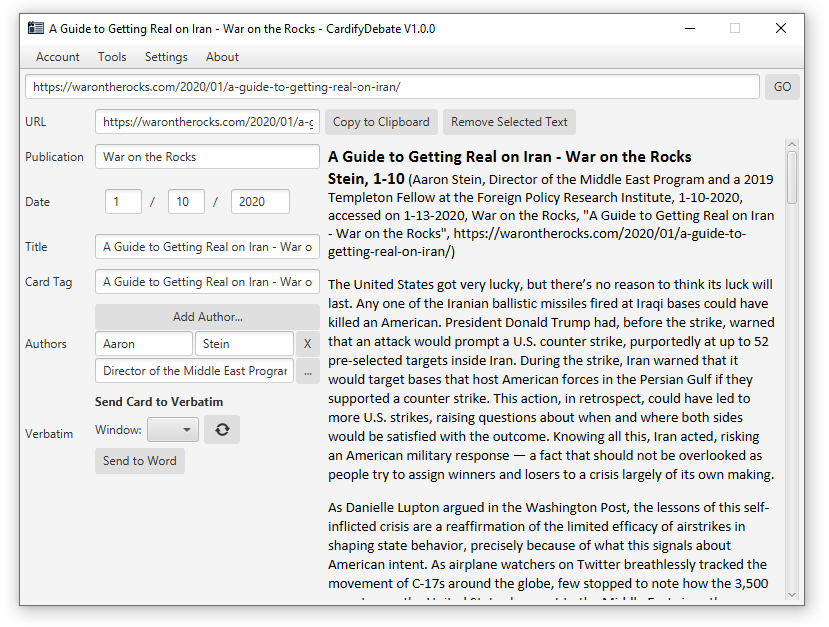
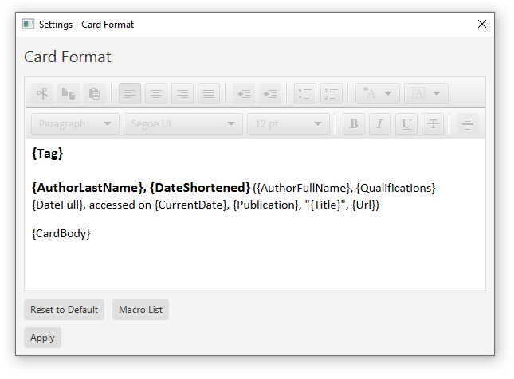

# CardifyDebate

http://cardifydebate.x10.bz

An advanced, next-gen debate evidence collector.

## Screenshots

## Installation

**Windows:**

1. Visit http://cardifydebate.x10.bz/download.html and download the latest Cardify installer.
2. Extract the ZIP file and double-click to launch the Cardify installer.
3. Once Cardify Desktop Client has installed,visit https://chrome.google.com/webstore/detail/cardifydebate/ifdnjffggmmjiammdpklgldliaaempce?hl=en to get the Chrome extension.

You're all good to go!

**OS X:** 

1. Visit http://cardifydebate.x10.bz/download.html and download the latest Cardify installer.
2. Extract the ZIP file. You should be presented with a *.pkg* installer for Cardify.
3. *Right click* the installer file and select "Open" in the context menu. See the  screenshot below.
4. In the system dialog that pops up asking for confirmation, select "Open". Follow the installer steps to install Cardify.
5. Once installed, you will have to manually launch Cardify at least once. Then, visit https://chrome.google.com/webstore/detail/cardifydebate/ifdnjffggmmjiammdpklgldliaaempce?hl=en to download the Chrome extension.

You're all good to go!

## General Information

CardifyDebate is a piece of software that makes it easier for high-school and collegiate debaters to conduct research and generate citations for evidence.

**Desktop Client:** *see /CardifyDebate/*

Cardify's Desktop Client is a program that creates debate cards for you. Once you paste in a webpage URL, you can easily manipulate attributes of the card (publication date, publisher, author(s), etc.) from the side panel. Cardify will automatically generate the citation, along with the card body, for you.

This was written almost entirely in Kotlin, but uses parts of C++ for access to Windows-specific and uses AppleScript for access to macOS-specific APIs. 

**Chrome Extension:** *see /CardifyExtension/*

The Chrome extension allows you to seamlessly integrate your research experience with the CardCutter desktop application.
It allows you to "send" a website into the Cardify desktop application by clicking the icon in the Chrome menu.

This simple extension was written using JavaScript.

## Credits
* Soham Govande - Founder & Lead Developer