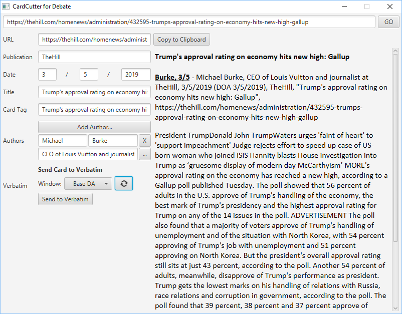

# CardCutter
Debate software convert a webpage into a Verbatim card with only two clicks.

## General Information

CardCutter consists of two components:

_The CardCutter Chrome extension_. 
The Chrome extension allows you to seamlessly integrate your research experience with the CardCutter desktop application.
It allows you to "send" a website into the CardCutter desktop application by clicking the icon in the Chrome menu.

- Currently only available on Windows computers. 

_The CardCutter desktop application._
The desktop application is a window that lets you paste in a URL to research
This app can be run standalone without the extension, but most users prefer to use both together for a more seamless research experience.
- Cross platform -- available on Windows and Mac.

**NOTE**: Because the desktop app (cross platform) works standalone, Mac users can use it without having to worry about the extension (Windows only).   

## Screenshots

## Credits
**Soham Govande** - Policy debater, developer of the extension and the desktop application
 