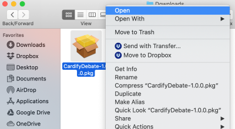

# Cardr
## Work cardr, not hardr.
Cardr is an advanced, next-gen evidence collector for debaters - http://cardr.x10.bz

## Installation

### Installing on Windows

1. Visit [the downloads page](http://cardr.x10.bz/download.html) and download the latest Cardr installer.
2. Extract the ZIP file and double-click to launch the Cardr installer.
3. Click "More Info" and then "Run Anyway" if SmartScreen tries to block the file. This is just a warning displayed to programs that don't have many downloads yet - Cardr is **not** a virus; you can check our VirusTotal rating [here](https://www.virustotal.com/gui/file/b74e925521e2d46dee7bdf72bd4754836284a1b96deac9d3fbc22d4eda98a9cd/detection).
4. Once Cardr Desktop Client has installed, [get the Chrome extension](https://chrome.google.com/webstore/detail/cardifydebate/ifdnjffggmmjiammdpklgldliaaempce?hl=en).

You're all good to go!

### Installing on macOS

1. Visit http://cardr.x10.bz/download.html and download the latest Cardr installer.
2. Extract the ZIP file. You should be presented with a *.pkg* installer for Cardr.
3. *Right click* the installer file and select "Open" in the context menu. See the  screenshot below.
4. In the system dialog that pops up asking for confirmation, select "Open". Follow the installer steps to install Cardr.
5. Once installed, you will have to manually launch Cardr at least once. Then, [get the Chrome extension](https://chrome.google.com/webstore/detail/cardifydebate/ifdnjffggmmjiammdpklgldliaaempce?hl=en).

You're all good to go!

## General Information

Cardr is a piece of software that makes it easier for high-school and collegiate debaters to conduct research and generate citations for evidence.

### Desktop Client

*CardrDesktop/*

Cardr's Desktop Client is a program that creates debate cards for you. Once you paste in a webpage URL, you can easily manipulate attributes of the card (publication date, publisher, author(s), etc.) from the side panel. Cardr will automatically generate the citation, along with the card body, for you.

The Desktop Client was written almost entirely in Kotlin, but some parts use C++ (*CardrWindowsCPP/* and *CardrMacCPP/*) for access to Windows-specific and macOS-specific APIs. 

### Chrome Extension

*CardrExtension/*

The Chrome extension allows you to seamlessly integrate your research experience with the Cardr Desktop Client.
It allows you to "send" a website into the Desktop Client by clicking the extension icon in the Chrome toolbar.

The Chrome extension was written using JavaScript.

## Credits
* Soham Govande - Founder & Lead Developer
